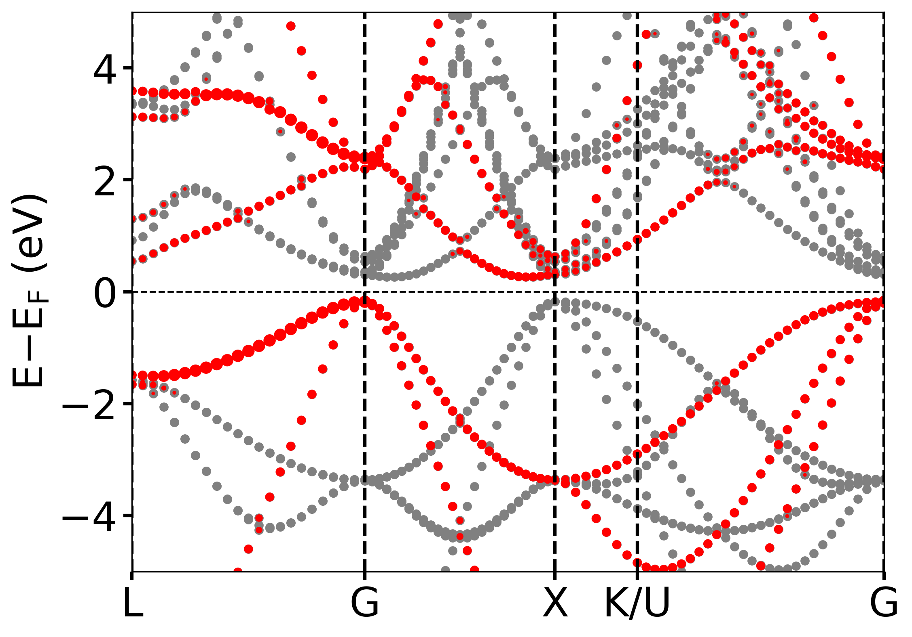
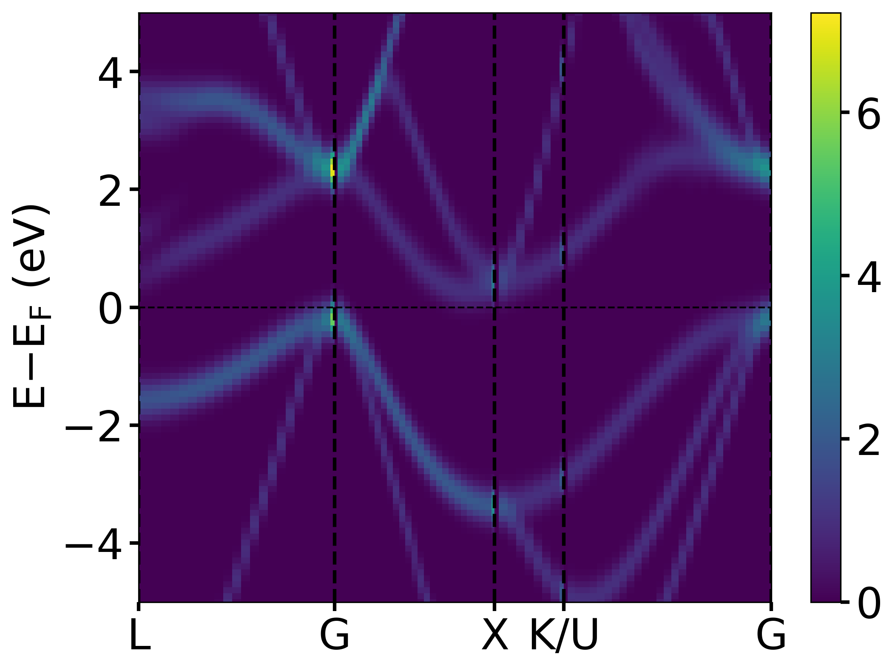
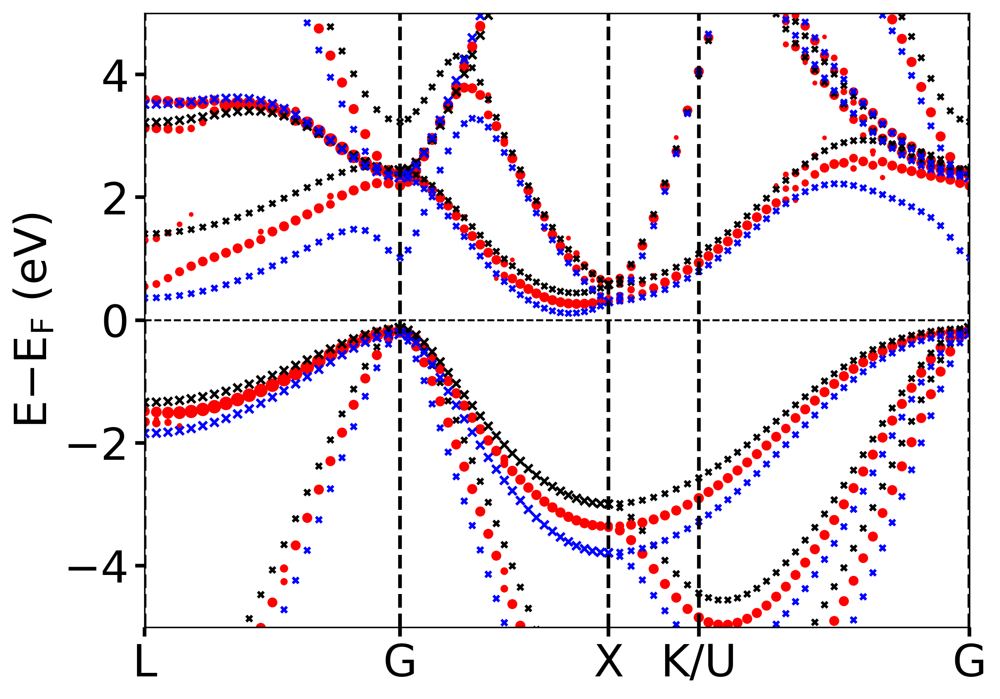
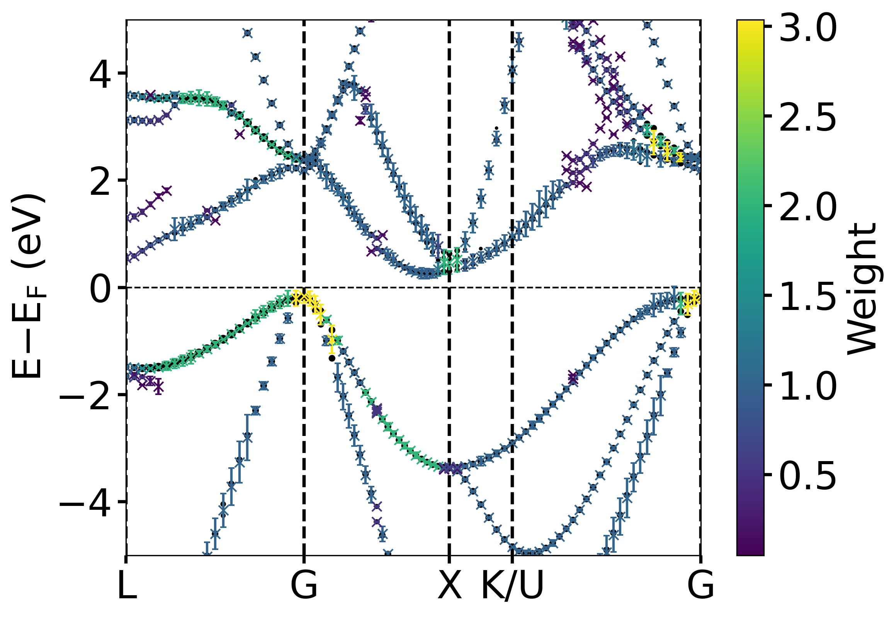

# `BandUP/BandUPpy`: Band Unfolding code for Plane-wave based calculations             
# `BandUPpy` - Python version of [BandUP](https://github.com/band-unfolding/bandup) code (not to be confused with bandupy - the interface and plotting tool of BandUP)

This is a Python version to the [BandUP](https://github.com/band-unfolding/bandup) code, made in order to restore
support for modern versions of QuantumEspresso and other codes. In order ot read the wavefunctions
stored by ab-initio codes, the routines of [irrep](https://github.com/stepan-tsirkin/irrep) are used. 

<!-- =========================================================== -->

<!-- =========================================================== -->
  |   |   |  
:-------------------------:|:-------------------------:|:-------------------------:|:-------------------------:
Unfolded band structure - flatband mode (Si0.5Ge0.5) |  Unfolded band structure - density mode (Si0.5Ge0.5) | Band structures overlay (Si0.5Ge0.5: Red, pure Si: black, pure Ge: blue) | Band centers and band width (Si0.5Ge0.5)
<!-- =========================================================== -->

<!-- =========================================================== -->
## Developers and contributors
<!-- =========================================================== -->

__Developer of BandUPpy :__ 

* [Stepan S. Tsirkin](https://github.com/stepan-tsirkin), University of Zurich, [stepan.tsirkin@uzh.ch](mailto:stepan.tsirkin@uzh.ch)

__BandUPpy Package is Restructured by (maintainer):__

* [Badal Mondal](https://github.com/bmondal94) 

__Developer of original BandUP :__ 

  *  Paulo V. C. Medeiros, Linköping University, (at present: SMHI, the Swedish Meteorological and Hydrological Institute)

  *  Jonas Björk, Linköping University
  
  *  [Stepan S. Tsirkin](https://github.com/stepan-tsirkin), (in 2015: Donostia International Physics Center)

__BandUPpy Contributors:__  [Contributors](https://github.com/band-unfolding/banduppy/graphs/contributors)

* We sincerely thank each and every contributor for their valuable input and support.

__Contact us:__ [Email developer/maintainer team](mailto:stepan.tsirkin@uzh.ch,badalmondal.chembgc@gmail.com) 

* If you would like to contribute to the development of `BandUPpy` or request new functionality, please get in touch with [us](mailto:stepan.tsirkin@uzh.ch,badalmondal.chembgc@gmail.com) or open a pull request. We will be happy to support your request ASAP. 

<!-- =========================================================== -->

<!-- =========================================================== -->
## Installation

### 1. Requirements
```
    1. python>=3.7
    2. collections
    3. numpy
    4. pickle
    5. scipy>=1.0
    6. irrep>=1.6.2
    7. matplotlib
```

### 2. Installation using `pip`

```
    pip install banduppy
```

### 3. Installation from github repository

```
    git clone https://github.com/band-unfolding/banduppy.git
    cd banduppy
    pip install .  
```

### 4. Installation using `setup.py` [deprecated]
Alternatively you can clone the repository and run `setup.py` in the usual manner:

```
    git clone https://github.com/band-unfolding/banduppy.git
    cd banduppy
    python setup.py install
```
<!-- =========================================================== -->

<!-- =========================================================== -->
##  Plane-wave codes currently supported by `BandUPpy`

At the moment, `BandUPpy` can parse wavefunctions generated by: 

  * [VASP](http://www.vasp.at)
  * [Quantum ESPRESSO](http://www.quantum-espresso.org)
  * [ABINIT](http://www.abinit.org)
  * any code that has interface to [Wannier90](http://wannier.org) (via reading the UNK* and *.eig files)
  * [CASTEP](http://www.castep.org)  --> __Not supported yet. Use the main code of BandUP.__

<!-- =========================================================== -->

<!-- =========================================================== -->
## Usage

Explore the [tutorial](tutorials) folder for detailed examples. Below are quick snippets showcasing what you can achieve with `BandUPpy`:
```
banduppy package:
    1. Unfolding class 
        1.1 propose_maximum_minimum_folding()
        1.2 generate_SC_Kpts_from_pc_kpts()
        1.3 generate_SC_Kpts_from_pc_k_path()
        1.3 Unfold()
        1.4 plot_ebs() [Note: Similar in Plotting class but can not plot band centers]
    2. BandStructure class
        2.1 BandStructure()
    3. Properties class
        3.1 band_centers_broadening_bandstr()
    4. Plotting class
        4.1 plot_ebs()
```

#### 1. Lat's start
##### ---------------------------- Import modules ---------------------------------
```
    import numpy as np
    import pickle
    import banduppy
```
##### ------------------------ Define variables ---------------------------------
###### Note: Only the VASP KPOINTS file format is implemented so far.
```
    # supercell : 4X4X2 supercell == np.diag([4,4,2]) or
    super_cell_size = [[-1,  1, 1], [1, -1, 1], [1,  1, -1]] 
    # k-path: L-G-X-U,K-G. If the segmant is skipped, put a None between nodes.
    PC_BZ_path = [[1/2,1/2,1/2], [0,0,0],[1/2,0,1/2], [5/8,1/4,5/8], None, [3/8,3/8,3/4], [0,0,0]] 
    # Number of k-points in each path segments. or, one single number if they are same.
    npoints_per_path_seg = (23,27,9,29) 
    # Labels of special k-points: list or string. e.g ['L','G','X','U','K','G'] or 'LGXUKG'
    special_k_points = "LGXUKG"
    # Weights of the k-points to be appended in the final generated k-points files
    kpts_weights = 1 
    # Save the SC kpoints in a file
    save_to_file = True 
    # Directory to save file
    save_to_dir = '<directory to save files>' 
    # File format of kpoints file that will be created and saved
    kpts_file_format = 'vasp' # This will generate vasp KPOINTS file format
```
#### 1. Estimate the best choice of number of kpoints to use in effective band structure each k-path segments considering maximizing or minimizing folding in the supercell.
##### __Motivation:__ Maximizing folding helps minimizing computational resource. 
__Definition:__ $\text{Folding percent} = \frac{\text{no. of unique PC kpoints} \ -\ \text{no. of folded SC Kpoints}}{\text{no. of unique PC kpoints}}\times100$
##### ------------------ Initiate Unfolding method -----------------------------
```
    band_unfold = banduppy.Unfolding(supercell=super_cell_size,
                                     print_log='high')
```
##### ------------- Propose degree of unfolding --------------------------------
```
    propose_folding_results = \
    band_unfold.propose_maximum_minimum_folding(PC_BZ_path, min_num_pts=10, max_num_pts=50,
                                                serach_mode='brute_force', draw_plots=True, 
                                                save_plot=False, save_dir='.', 
                                                save_file_name=None)
```
#### 2. Create SC kpoints from PC band path
##### ------------ Creating SC folded kpoints from PC band path -----------------
__Note:__ band_unfold.generate_SC_Kpts_from_pc_kpts() can be used to generate SC Kpoints from PC kpoints list.
```
    kpointsPBZ_full, kpointsPBZ_unique, kpointsSBZ, \
        SBZ_PBZ_kpts_mapping, special_kpoints_pos_labels \
        = band_unfold.generate_SC_Kpts_from_pc_k_path(pathPBZ = PC_BZ_path,
                                                      nk = npoints_per_path_seg,
                                                      labels = special_k_points,
                                                      kpts_weights = kpts_weights,
                                                      save_all_kpts = save_to_file,
                                                      save_sc_kpts = save_to_file,
                                                      save_dir = save_to_dir,
                                                      file_name_suffix = '',
                                                      file_format=kpts_file_format)
```
#### 3. Unfold band structure
```
    read_dir = '<path where the vasp output files are>'
```
##### ------------------------ Read wave function file --------------------------
```
    bands = banduppy.BandStructure(code="vasp", spinor=False,
                                   fPOS = f"{read_dir}/POSCAR",
                                   fWAV = f"{read_dir}/WAVECAR")
```
##### ----------------- Unfold the band structures ------------------------------
```
    # save2file : Save unfolded kpoints or not? 
    # fdir : Directory path where to save the file.
    # fname : Name of the file.
    # fname_suffix : Suffix to add to the file name.
```
__Option 1:__ Continue with previous instance.
```
    unfolded_bandstructure_, kpline \
    = band_unfold.Unfold(bands, kline_discontinuity_threshold = 0.1, 
                        save_unfolded_kpts = {'save2file': True, 
                                              'fdir': save_to_dir,
                                              'fname': 'kpoints_unfolded',
                                              'fname_suffix': ''},
                        save_unfolded_bandstr = {'save2file': True, 
                                                'fdir': save_to_dir,
                                                'fname': 'bandstructure_unfolded',
                                                'fname_suffix': ''})
```
__Option 2:__ If this part is used independently from the above instances re-initiate the Unfolding module.
```
    # --------------------- Initiate Unfolding method --------------------------
    band_unfold = banduppy.Unfolding(supercell=super_cell_size, print_info='high')

    # ----------------- Unfold the band structures ------------------------------
    unfolded_bandstructure_, kpline \
    = band_unfold.Unfold(bands, PBZ_kpts_list_full=kpointsPBZ_full, 
                         SBZ_kpts_list=kpointsSBZ, 
                         SBZ_PBZ_kpts_map=SBZ_PBZ_kpts_mapping,
                         kline_discontinuity_threshold = 0.1, 
                         save_unfolded_kpts = {'save2file': True, 
                                              'fdir': save_to_dir,
                                              'fname': 'kpoints_unfolded',
                                              'fname_suffix': ''},
                         save_unfolded_bandstr = {'save2file': True, 
                                                'fdir': save_to_dir,
                                                'fname': 'bandstructure_unfolded',
                                                'fname_suffix': ''})
```
#### 5. Determine band centers and band width
```
# This uses SCF algorithm of automatic band center determination from 
# PRB 89, 041407(R) (2014) paper.
# -------------------- Initiate Properties method -----------------------------
    unfolded_band_properties = banduppy.Properties(print_log='high')
    min_sum_dNs_for_a_band = 0.05 
    threshold_dN_2b_trial_band_center = 0.05
    prec_pos_band_centers = 1e-5 # in eV
    err_tolerance = 1e-8
    min_dN = 1e-5  
    
    unfolded_bandstructure_properties, all_scf_data = \
        unfolded_band_properties.band_centers_broadening_bandstr(unfolded_bandstructure_, 
                                                                 min_dN_pre_screening=min_dN,
                                                                 threshold_dN_2b_trial_band_center=
                                                                 threshold_dN_2b_trial_band_center,
                                                                 min_sum_dNs_for_a_band=min_sum_dNs_for_a_band, 
                                                                 precision_pos_band_centers=prec_pos_band_centers,
                                                                 err_tolerance_compare_kpts=err_tolerance,
                                                                 collect_scf_data=False)
```
#### 4. Plot unfolded band structure (scatter plot/density plot/band_centers plot)
##### --------------------- Plot band structure ---------------------------------
```
    # Fermi energy
    Efermi = 5.9740
    # Minima in Energy axis to plot
    Emin = -5
    # Maxima in Energy axis to plot
    Emax = 5
    # Filename to save the figure. If None, figure will not be saved
    save_file_name = 'unfolded_bandstructure.png'
```
__Option 1:__ Continue with previous instance.
```
    fig, ax, CountFig \
    = band_unfold.plot_ebs(save_figure_dir=save_to_dir, save_file_name=save_file_name, CountFig=None, 
                          Ef=Efermi, Emin=Emin, Emax=Emax, pad_energy_scale=0.5, 
                          mode="density", special_kpoints=special_kpoints_pos_labels, 
                          plotSC=True, fatfactor=20, nE=100,smear=0.2, marker='o',
                          threshold_weight=0.01, show_legend=True,
                          color='gray', color_map='viridis')
```
__Option 2:__ Using BandUPpy Plotting module.
```
    # --------------------- Initiate Plotting method ----------------------------
    plot_unfold = banduppy.Plotting(save_figure_dir=save_to_dir)
    
    # -------- Read the saved unfolded bandstructure saved data file ------------
    unfolded_bandstructure_ = np.loadtxt(f'{save_to_dir}/bandstructure_unfolded.dat')
    kpline = np.loadtxt(f'{save_to_dir}/kpoints_unfolded.dat')[:,1]
    with open(f'{save_to_dir}/KPOINTS_SpecialKpoints.pkl', 'rb') as handle:
        special_kpoints_pos_labels = pickle.load(handle)
        
    fig, ax, CountFig \
    = plot_unfold.plot_ebs(kpath_in_angs=kpline, unfolded_bandstructure=unfolded_bandstructure_, 
                           save_file_name=save_file_name, CountFig=None, 
                           Ef=Efermi, Emin=Emin, Emax=Emax, pad_energy_scale=0.5, 
                           mode="density", special_kpoints=special_kpoints_pos_labels, 
                           plotSC=True, fatfactor=20, nE=100,smear=0.2, marker='o',
                           threshold_weight=0.01, show_legend=True, 
                           color='gray', color_map='viridis')
```
##### ----------------- Plot the band centers -----------------------------------
```
    # --------------------- Initiate Plotting method ----------------------------
    plot_unfold = banduppy.Plotting(save_figure_dir=save_to_dir)

    # --------------------- Plot band centers and band width --------------------
    fig, ax, CountFig \
        = plot_unfold.plot_ebs(kpath_in_angs=kpline, 
                               unfolded_bandstructure=unfolded_bandstructure_properties, 
                               save_file_name=save_file_name, CountFig=None, 
                               Ef=Efermi, Emin=Emin, Emax=Emax, pad_energy_scale=0.5, 
                               mode="band_centers", special_kpoints=special_kpoints_pos_labels, 
                               marker='x', smear=0.2, plot_colormap_bandcenter=True,
                               color='black', color_map='viridis')
```

##### ------------ Plot and overlay multiple band structures --------------------
```
    fig, ax, CountFig \
    = plot_unfold.plot_ebs(kpath_in_angs=kpline1, 
                            unfolded_bandstructure=unfolded_bandstructure_1, 
                            save_file_name=None, CountFig=None, threshold_weight=0.1,
                            Ef=Efermi, Emin=Emin, Emax=Emax, pad_energy_scale=0.5, 
                            mode="fatband", special_kpoints=special_kpoints_pos_labels1, 
                            plotSC=True, fatfactor=20, nE=100, smear=0.2,
                            color='red', color_map='viridis')
    
    fig, ax, CountFig \
    = plot_unfold.plot_ebs(ax=ax, kpath_in_angs=kpline1, 
                            unfolded_bandstructure=unfolded_bandstructure_properties, 
                            save_file_name=save_file_name, CountFig=None, 
                            Ef=Efermi, Emin=Emin, Emax=Emax, pad_energy_scale=0.5, 
                            mode="band_centers", special_kpoints=None, 
                            marker='x', smear=0.2,
                            color='black', color_map='viridis')
```
<!-- =========================================================== -->

<!-- =========================================================== -->
## Citations and references:

If you use `BandUPpy` in your work, you should:

  * **State EXPLICITLY that you've used the BandUP code** 
    (or a modified version of it, if this is the case).
  * **Read and cite the following papers** (and the appropriate
    references therein):
    
>> Paulo V. C. Medeiros, Sven Stafström, and Jonas Björk,
   [Phys. Rev. B **89**, 041407(R) (2014)](http://dx.doi.org/10.1103/PhysRevB.89.041407)  
>> Paulo V. C. Medeiros, Stepan S. Tsirkin, Sven Stafström, and Jonas Björk,
   [Phys. Rev. B **91**, 041116(R) (2015)](http://dx.doi.org/10.1103/PhysRevB.91.041116)


If you use `BandUPpy`,  please also cite

>> Mikel Iraola, Juan L. Mañes, Barry Bradlyn, Titus Neupert, Maia G. Vergniory, Stepan S. Tsirkin 
   "IrRep: symmetry eigenvalues and irreducible representations of ab initio band structures", [arXiv:2009.01764](https://arxiv.org/abs/2009.01764)

An appropriate way of acknowledging the use of BandUP in your
publications would be, for instance, adding a sentence like: 

         "The unfolding has been performed using the BandUP code"

followed by the citation to our papers.

### Refer to for further details
##### <http://www.ifm.liu.se/theomod/compphys/band-unfolding>
##### <https://github.com/band-unfolding/bandup>

<!-- =========================================================== -->

<!-- =========================================================== -->
## License

`BandUPpy` is free software: you can redistribute it and/or modify
it under the terms of the GNU General Public License as published by
the Free Software Foundation, either version 3 of the License, or
(at your option) any later version.

`BandUPpy` is distributed in the hope that it will be useful,
but WITHOUT ANY WARRANTY; without even the implied warranty of
MERCHANTABILITY or FITNESS FOR A PARTICULAR PURPOSE.  See the
GNU General Public License for more details.

You should have received a copy of the GNU General Public License
along with BandUP.  If not, see <http://www.gnu.org/licenses/>.
<!-- =========================================================== -->

<!-- =========================================================== -->
## Upcoming (TBD)
1. Effective mass implementation
2. Scattering potential implementation
3. Orbital contribution projection implementation
<!-- =========================================================== -->

